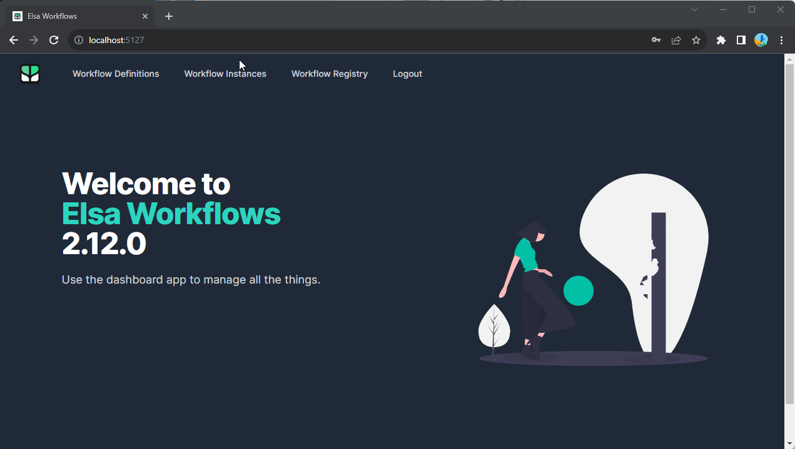

## ADD KEYCLOAK TO ELSA V2

### Add keycloak plugin into to module designer/esla-workflows-studio/src/modules/keycloak
```javascript
import Keycloak, { KeycloakConfig } from 'keycloak-js';
import {Service} from 'axios-middleware';
import { ElsaPlugin, eventBus } from '../../services';
import { EventTypes } from '../../models';

export class KeycloakPlugin implements ElsaPlugin {
    private config: KeycloakConfig;
    private keycloak: Keycloak;
  
    constructor(config: KeycloakConfig) {
      this.config = config; 
      eventBus.on(EventTypes.Root.Initializing, this.initialize)
      eventBus.on(EventTypes.HttpClientCreated, this.configureAuthMiddleware);
    }
  
    private initialize = async () => {  
      this.keycloak = new Keycloak(this.config);
      console.log('setup keycloak');
      if (!this.keycloak.authenticated){
        await this.keycloak.init({onLoad: 'login-required'});
      }
    };
  
    private configureAuthMiddleware = async (e: any) => {
  
      const service: Service = e.service;
      const keycloak = this.keycloak;
  
      service.register({
        async onRequest(request) {
  
          // Get a (cached) access token.
          const token = await keycloak.token;
  
          if(!!token)
            request.headers = {...request.headers, 'Authorization': `Bearer ${token}`};
          return request;
        }
      });
    };
  }
  
```
### Export module keycloak in index.ts
```javascript
export * from './modules/keycloak/keycloak-plugin';
```
### Import KeycloakPlugin in index.html
```javascript
import {confirmDialogService, EventTypes, WebhooksPlugin, CredentialManagerPlugin, WorkflowSettingsPlugin, Auth0Plugin, KeycloakPlugin} from "/build/index.esm.js";
```

### Build designer/esla-workflows-studio module
`npm install keycloak-js`
`npm run build`

### Build src\designer\bindings\aspnet\Elsa.Designer.Components.Web module
`npm run build:release`